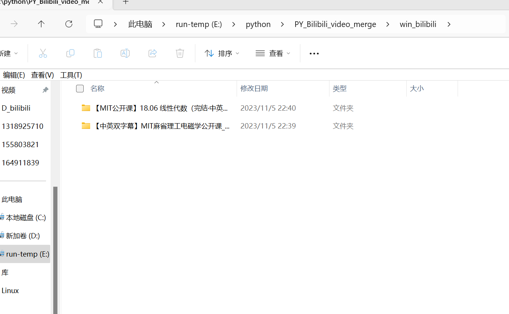

# PY-Bilibili video merge

This is a simple video processing tool that uses `ffmpeg` to merge video and audio files downloaded from the `bilibili` app. Please make sure you have installed and configured the `ffmpeg` and `python` environments before running.

## language ：【[EN](README_EN.md "English")】【[ZH](README.md "中文")】

## System environment description

- **Test environment： Win11 23H2**  
- **VSCode version：1.84.0**  
- **Python tool version：3.8.16**

## Project Features

- **Automatically identify PC and phone projects**
- **Automatic decryption**
- **Automatically organize into a collection**
- **Automatically sort the collection items**
- **Add the original ‘BV’ number to the collection project folder and**
- **individual video files for easy access to the original video**

## Project Execution

Run the `run.py` file and then paste your file download directory, **for example:**

```shell

PS E:\python\PY_Bilibili_video_merge> & "D:/Program Files/conda3/envs/bli/python.exe" e:/python/PY_Bilibili_video_merge/run.py
Please enter your bilibili download directory:     E:\Video Download\bilibili
(Executing commands.....)
Execution complete!

```

After execution, there should be a folder named `D_bilibili` or `win_bilibili` in the directory where you currently run the script.


