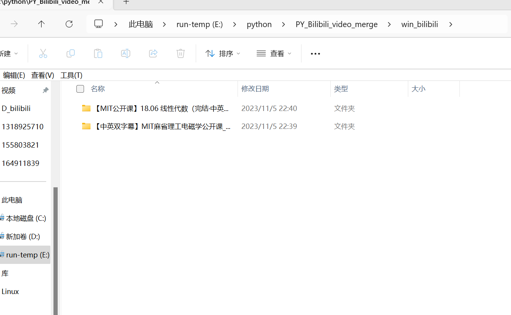

# PY-哔哩哔哩视频合并

这是一个简单的视频处理工具，它采用`ffmpeg`对`哔哩哔哩`应用程序下载的视频文件和音频文件进行合并处理，在运行前请确保你已经安装并配置好`ffmpeg`与`python`环境

## 语言:【[EN](README.md "English")】【[ZH](README_zh.md "中文")】

## 系统环境说明

- **测试环境：win11 23h2**
- **VSCode版本：18.14.0**
- **Python工具版本：3.8.16**

## 项目功能

- **自动识别pc端和phone端项目**
- **自动解密**
- **自动整理成集合**
- **对集合项目自动进行排序**
- **在集合项目文件夹和单个视频文件添加原来的BV号方便访问原来视频**

## 项目运行

运行`run.py`文件然后粘贴你的文件下载目录,**例如:**

```shell

PS E:\python\PY_Bilibili_video_merge> python run.py
请输入你的bilibili下载目录:     E:\视频下载\bilibili
(执行指令中.....)
执行完成！

```

执行完之后，你当前执行脚本的目录就应该有一个`D_bilibili`或者`win_bilibili`的文件夹。

